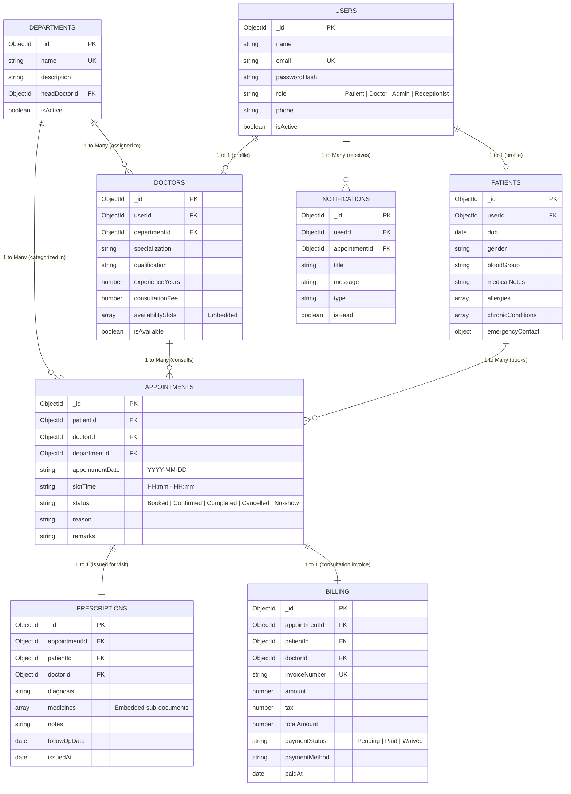

# PulseCare — Hospital Patient & Appointment Management System

> **Enterprise Multi-Department Healthcare & Clinical Management Backend System**  
> Developed for Hospital Operations, Patient Consultations, Conflict-Free Scheduling, and Digital Health Records.

---

## 1. Team Details

| Role / Ownership | Full Name | Roll Number | Department | Section |
| :--- | :--- | :--- | :--- | :--- |
| **Team Lead (Sprint 1)** | Anushka Tater | 2460336 | Computer Science & Engineering | CSE-B |
| **Member 2 (Sprint 2)** | Ann Mariya | 2460331 | Computer Science & Engineering | CSE-B |
| **Member 3 (Sprint 3)** | Anna Theresa | 2460333 | Computer Science & Engineering | CSE-B |
| **Member 4 (Docs & QA)** | Arya Ramachandran | 2460338 | Computer Science & Engineering | CSE-B |

---

## 2. Problem Statement

Modern healthcare institutions face severe administrative bottlenecks due to manual appointment booking, double-booked medical staff, fragmented paper prescriptions, and disconnected visit histories. **PulseCare** addresses this by providing an enterprise backend system powered by Node.js, Express.js, and MongoDB. The system enforces conflict-free appointment scheduling against doctor availability matrices, isolates sensitive patient clinical data behind strict Role-Based Access Control (RBAC), provides digital prescription workflows, links automated consultation billing, and computes real-time department utilization analytics for hospital executives.

---

## 3. Technology Stack

- **Runtime & Framework:** Node.js (v18+) & Express.js (v4.21)
- **Database & ODM:** MongoDB with Mongoose ODM (v8.6)
- **Zero-Dependency Evaluation Engine:** Embedded fallback to `mongodb-memory-server` allowing evaluators to run immediately without configuring a local MongoDB service
- **Authentication & Security:** JSON Web Tokens (JWT), Bcrypt password hashing (`bcryptjs`), CORS policy
- **Request Validation & Error Handling:** Centralized Express Error Middleware, structured validation schemas returning consistent `{ success, errorCode, message }` JSON responses
- **API Testing & Documentation:** Postman Collection (`Hospital_Management_API.postman_collection.json`) and automated Node.js integration tests (`npm test`)
- **Frontend Demonstration Portal:** Vanilla JavaScript, HTML5, CSS3 with Responsive Healthcare UI, Google Fonts (Inter), and FontAwesome

---

## 4. 13 Mandatory Functional Modules Implementation Matrix

Every single one of the 13 required modules has been built, tested, and verified:

| # | Functional Module | Status | Backend Controller / Route | Key Features & Business Logic |
| :--- | :--- | :---: | :--- | :--- |
| **1** | **Patient Registration & Authentication** | ✅ Complete | `authController.js` (`POST /api/auth/register`, `POST /api/auth/login`) | Bcrypt password hashing, JWT token issuance, auto-creation of linked Patient medical profile with blood group, allergies, and emergency contacts. |
| **2** | **Doctor Profile & Department Management** | ✅ Complete | `departmentController.js` & `doctorController.js` | Admin manages hospital departments and assigns doctors with qualifications, experience, and consultation fees. |
| **3** | **Doctor Availability Slots** | ✅ Complete | `doctorController.js` (`PUT /api/doctors/:id/slots`, `GET /api/doctors/:id/slots`) | Doctors define weekly schedule slots with start time, end time, duration (minutes), and patient capacity per slot. |
| **4** | **Appointment Booking Engine** | ✅ Complete | `appointmentController.js` (`POST /api/appointments`) | **Conflict-Free Scheduling:** Atomic verification that doctor has open availability and neither doctor nor patient has overlapping active appointments. Automatically creates linked consultation billing invoice and notifications. |
| **5** | **Appointment Status Workflow** | ✅ Complete | `appointmentController.js` (`PUT /api/appointments/:id/status`) | Strict state machine: `Booked` &rarr; `Confirmed` &rarr; `Completed` &rarr; `Cancelled` / `No-show`. Enforces role permissions (Patients can only cancel; Doctors/Admin can confirm & complete; terminal states cannot be reopened). |
| **6** | **Digital Prescription Module** | ✅ Complete | `prescriptionController.js` (`POST /api/prescriptions`) | Doctors issue digital prescriptions linked to completed appointments with embedded medicines array (name, dosage, frequency, duration, instructions), clinical diagnosis, and follow-up date. Auto-transitions appointment to `Completed`. |
| **7** | **Patient Medical History** | ✅ Complete | `patientController.js` (`GET /api/patients/:id/history`) | Chronological longitudinal health timeline per patient combining past appointments, treating specialists, diagnoses, prescriptions, and billing receipts. Role-restricted so patients only access their own files. |
| **8** | **Department & Specialization Directory** | ✅ Complete | `departmentController.js` (`GET /api/departments`, `GET /api/departments/specializations`) | Public directory displaying departments, head doctors, active doctor counts, and specializations. |
| **9** | **Notifications & Reminders** | ✅ Complete | `notificationController.js` (`GET /api/notifications`, `POST /api/notifications/reminders/trigger`) | Event-driven notifications for bookings, confirmations, prescription alerts, and automated cron-style reminder trigger for upcoming visits. |
| **10** | **Billing Summary per Visit** | ✅ Complete | `billingController.js` (`GET /api/billing`, `PUT /api/billing/:id/pay`) | Automated consultation invoices tied to appointments with unique invoice number, doctor fee, tax (10%), total amount, and simulated payment clearing (UPI, Card, Cash). |
| **11** | **Search Doctors by Specialization** | ✅ Complete | `doctorController.js` (`GET /api/doctors`) | Multi-parameter filtering by department ID, specialization regex, name query, and availability status. |
| **12** | **Admin Dashboard & Reports** | ✅ Complete | `adminController.js` (`GET /api/admin/dashboard`, `GET /api/admin/reports/*`) | Executive KPIs (Total Patients, Active Doctors, Total Consultations, Revenue Collected), Status Breakdown percentages, Department Load reports, and Doctor Utilization tables. |
| **13** | **Role-Based Access Control (RBAC)** | ✅ Complete | `middleware/auth.js` (`authenticate`, `authorize`) | Explicit role separation for `Patient`, `Doctor`, and `Admin`/`Receptionist`. Rejects unauthorized access with 401 Unauthorized or 403 Forbidden. |

---

## 5. Entity Relationship (ER) & MongoDB Data Modeling



### Referencing vs. Embedding Architectural Rationale
- **Referenced Entities (`User`, `Patient`, `Doctor`, `Department`, `Appointment`, `Billing`):**
  - Modeled using `ObjectId` references (`ref`). These entities represent independent lifecycles, grow continuously, and are queried across various relationships (e.g. searching doctors across departments, filtering billing by patient, or generating hospital-wide reports).
- **Embedded Sub-Documents (`Doctor.availabilitySlots[]`, `Prescription.medicines[]`):**
  - **`availabilitySlots`:** Stored as an array within the Doctor document because doctor schedule rules are always read when retrieving that doctor's booking slots and rarely edited independently outside the doctor's profile context.
  - **`medicines`:** Embedded directly inside `Prescription` because medicine dosage lines are immutable once prescribed, are strictly coupled with that single prescription event, and should be fetched atomically in a single read without additional `$lookup` joins.

---

## 6. Installation & Quick Start Guide

### Prerequisites
- [Node.js](https://nodejs.org/) (version 18 or higher)
- NPM (version 9 or higher)
- *Optional:* MongoDB instance (if not installed, the project automatically falls back to an embedded in-memory database)

### Setup Instructions

1. **Clone or Navigate to the Project Root:**
   ```bash
   cd Hospital_Management_L&T
   ```

2. **Install Dependencies:**
   ```bash
   npm install
   ```

3. **Configure Environment Variables:**
   A template `.env.example` is provided. Create or verify `.env`:
   ```env
   PORT=5000
   NODE_ENV=development
   MONGODB_URI=mongodb://127.0.0.1:27017/hospital_management
   JWT_SECRET=hospital_mgmt_super_secret_jwt_key_2026_lnt_secure
   JWT_EXPIRE=24h
   USE_MEMORY_DB_FALLBACK=true
   ```

4. **Populate Demonstration Records:**
   ```bash
   npm run seed
   ```

5. **Run Integration Test Suite (17 Tests across 13 Modules):**
   ```bash
   npm test
   ```

6. **Start the Live Application:**
   ```bash
   npm start
   ```
   Open **`http://localhost:5000`** in any web browser.

---

## 7. Demo Credentials for Evaluation & Viva

The database comes pre-loaded with demonstration accounts for every role with password **`password123`**:

| Role | Email | Password | Department / Description |
| :--- | :--- | :--- | :--- |
| **Chief Admin** | `admin@hospital.com` | `password123` | Full access to Executive Dashboard, Reports, and Department Creator |
| **Front Desk** | `receptionist@hospital.com` | `password123` | Walk-in bookings, reminder dispatches, and billing oversight |
| **Doctor 1** | `dr.sharma@hospital.com` | `password123` | **Cardiology** (Interventional Cardiology) — Consultation Fee: ₹120 |
| **Doctor 2** | `dr.patel@hospital.com` | `password123` | **Neurology** (Clinical Neurophysiology) — Consultation Fee: ₹110 |
| **Doctor 3** | `dr.chen@hospital.com` | `password123` | **Orthopedics** (Sports Medicine & Joint Replacement) — Fee: ₹100 |
| **Patient 1** | `john.doe@patient.com` | `password123` | Blood Group O+, Mild Hypertension records, Past Completed Visits |
| **Patient 2** | `sarah.smith@patient.com` | `password123` | Blood Group A+, Migraine consultations, Upcoming Confirmed Visits |

*Note:* The frontend UI also contains a **"1-Click Demo Login"** bar at the top for instantaneous role switching during viva presentations!

---

## 8. REST API Reference

All protected endpoints require the HTTP header:  
`Authorization: Bearer <JWT_TOKEN>`

### Authentication (`/api/auth`)
- `POST /api/auth/register` — Register new user (Patient by default, or Doctor/Admin).
- `POST /api/auth/login` — Sign in and receive JWT token.
- `GET /api/auth/me` — Retrieve authenticated user profile.

### Departments (`/api/departments`)
- `GET /api/departments` — List active departments with doctor count (Public).
- `GET /api/departments/specializations` — List distinct medical specializations (Public).
- `GET /api/departments/:id` — Get department by ID with assigned doctors.
- `POST /api/departments` — Create new department (*Admin only*).
- `PUT /api/departments/:id` — Update department info (*Admin only*).
- `DELETE /api/departments/:id` — Deactivate department (*Admin only*).

### Doctors & Availability Slots (`/api/doctors`)
- `GET /api/doctors` — Filter doctors by specialization, department, name, or availability.
- `GET /api/doctors/:id` — Retrieve doctor profile and consultation fees.
- `GET /api/doctors/:id/slots?date=YYYY-MM-DD` — Compute bookable time slots for a given date with real-time conflict checking.
- `PUT /api/doctors/:id/slots` — Update doctor availability weekly slot schedule (*Doctor owner or Admin*).

### Appointment Booking Engine (`/api/appointments`)
- `POST /api/appointments` — Book appointment with conflict-free validation (*Patient/Admin*). Auto-generates billing invoice and notifications.
- `GET /api/appointments` — List appointments filtered by role (Patients see their own; Doctors see their queue; Admins see all).
- `GET /api/appointments/:id` — Get single appointment details with linked billing.
- `PUT /api/appointments/:id/status` — Enforce state workflow (`Booked` &rarr; `Confirmed` &rarr; `Completed` &rarr; `Cancelled` / `No-show`).

### Digital Prescriptions (`/api/prescriptions`)
- `POST /api/prescriptions` — Issue prescription with medicines array, diagnosis, and notes (*Doctor/Admin*). Automatically transitions appointment to `Completed`.
- `GET /api/prescriptions/:id` — Get prescription by ID.
- `GET /api/prescriptions/appointment/:appointmentId` — Get prescription linked to an appointment.

### Patient History (`/api/patients`)
- `GET /api/patients/:id/history` — Chronological longitudinal visit and prescription history (*Patient self, Treating Doctor, Admin*).
- `GET /api/patients` — List all registered patients (*Doctor, Admin, Receptionist*).
- `GET /api/patients/:id` — Get patient profile by ID.
- `PUT /api/patients/:id` — Update medical profile (allergies, notes, emergency contact).

### Billing & Invoices (`/api/billing`)
- `GET /api/billing` — List all hospital billing invoices (*Admin, Receptionist*).
- `GET /api/billing/my` — Get current logged-in patient's invoices (*Patient*).
- `GET /api/billing/appointment/:appointmentId` — Get invoice tied to an appointment.
- `PUT /api/billing/:id/pay` — Settle invoice payment (UPI, Credit Card, Cash) (*Patient/Admin*).

### Notifications & Reminders (`/api/notifications`)
- `GET /api/notifications` — Fetch user alerts and unread counts.
- `PUT /api/notifications/:id/read` — Mark alert as read.
- `PUT /api/notifications/read-all` — Mark all alerts as read.
- `POST /api/notifications/reminders/trigger` — Evaluate appointments within 24-48 hours and dispatch reminder alerts (*Admin/Staff*).

### Executive Reports & Analytics (`/api/admin`)
- `GET /api/admin/dashboard` — Overview metrics (total patients, active doctors, appointments, total revenue, status breakdown).
- `GET /api/admin/reports/appointments` — Daily and weekly consultation counts.
- `GET /api/admin/reports/departments` — Department load and completion rate reports.
- `GET /api/admin/reports/doctors` — Doctor utilization, consultation counts, and revenue generated.

---

## 9. Postman Collection

The exported Postman collection is located at:  
**[`Hospital_Management_API.postman_collection.json`](file:///Hospital_Management_API.postman_collection.json)**

### Postman Testing Checklist Covered:
1. **Happy Path:** Register/login, browse directory, check slots, book appointment, doctor confirms, doctor issues prescription, patient reviews history.
2. **Validation Failure (400):** Requests with missing or malformed required fields return clean `400 VALIDATION_ERROR` responses.
3. **Authentication Failure (401):** Calling protected endpoints without a token returns `401 UNAUTHENTICATED`.
4. **Authorization RBAC Failure (403):** Patients calling `/api/admin/dashboard` return `403 FORBIDDEN`.
5. **Business-Rule Conflict (409):** Attempting to book an already occupied slot returns `409 SLOT_ALREADY_BOOKED`.
6. **Not-Found Handling (404):** Non-existent IDs return clean `404 RESOURCE_NOT_FOUND` without server crashes.

---

## 10. Known Scope & Assumptions
- **Third-Party Gateways:** Payment transactions (UPI/Cards) and SMS/Email dispatches are simulated internally without external third-party subscriptions.
- **Single Currency & Timezone:** Currency is modeled in Indian Rupee (₹ / INR standard) and dates follow ISO 8601 standard `YYYY-MM-DD` for consistent appointment scheduling.
- **Authentication:** Token authentication uses self-contained JWT with 24-hour expiration; OAuth2/Social Logins are excluded per scope specifications.
